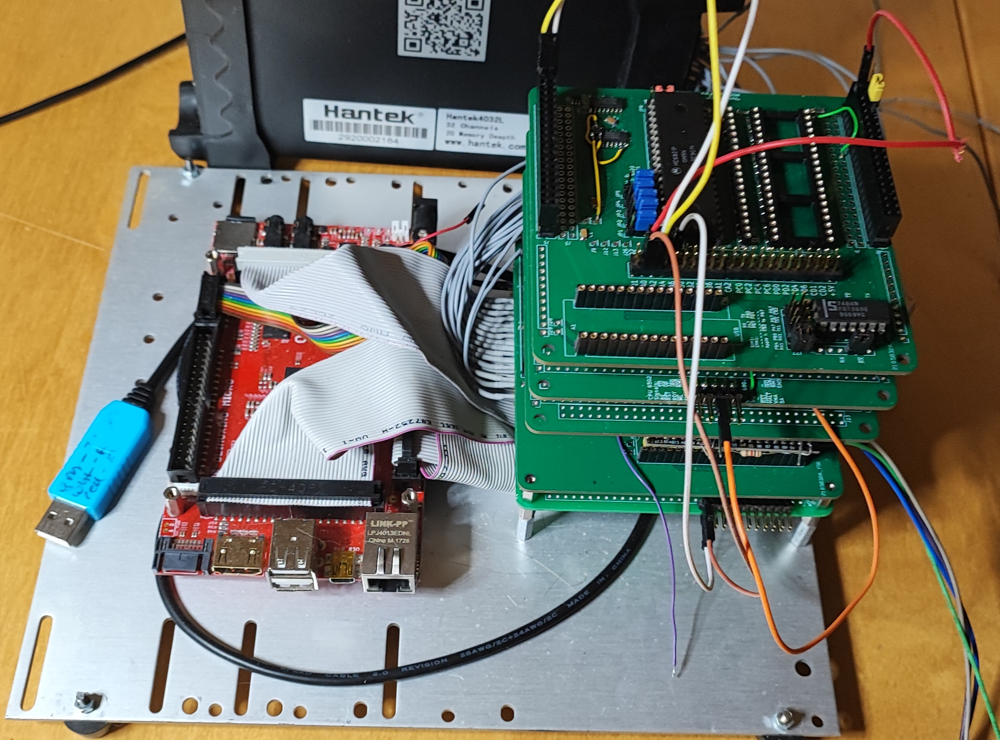
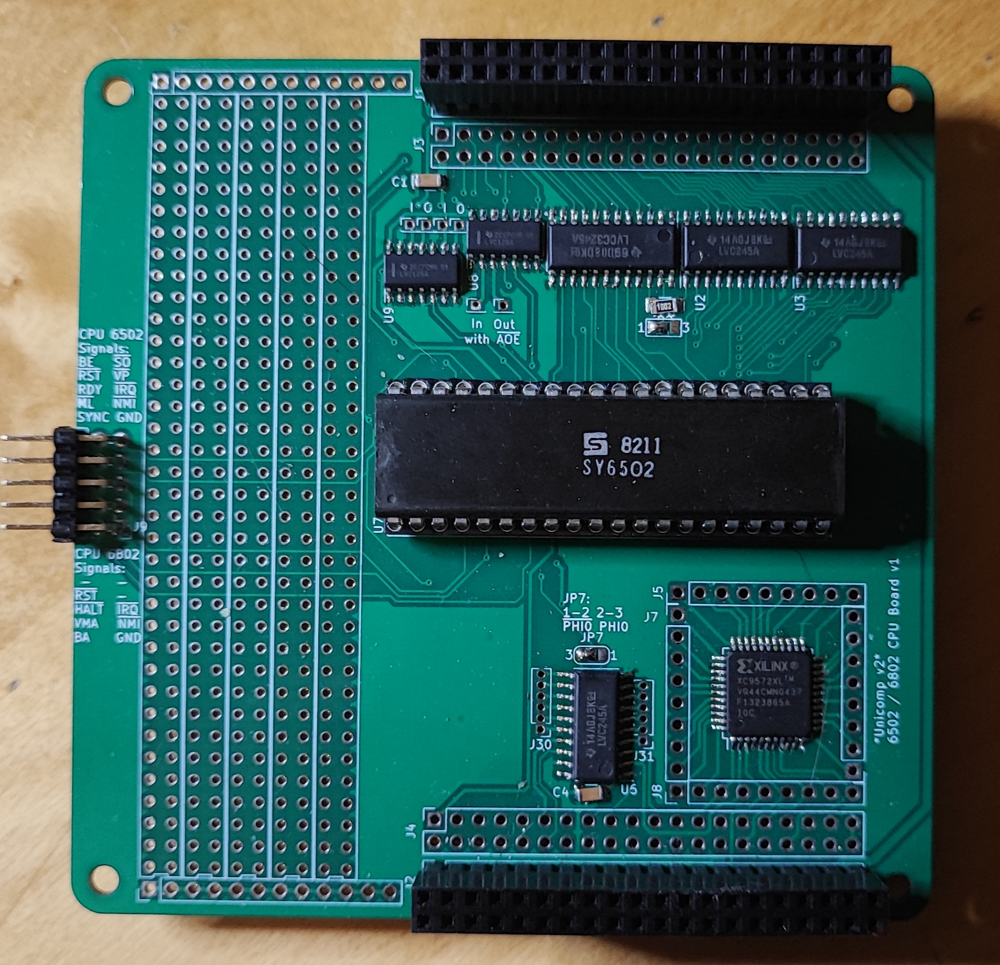
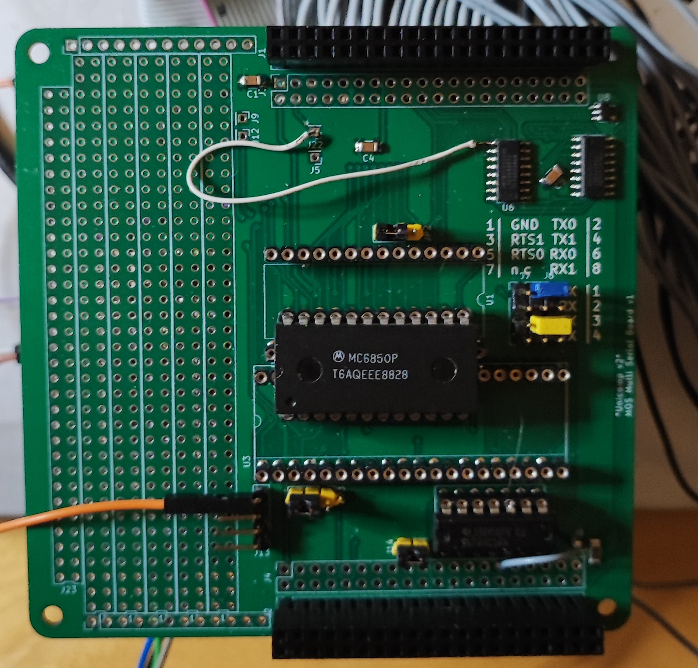
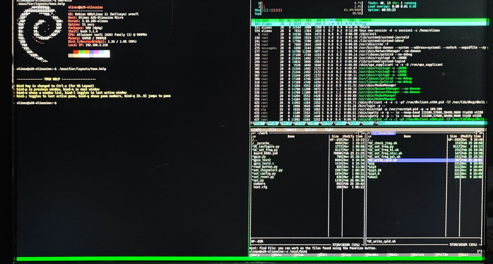
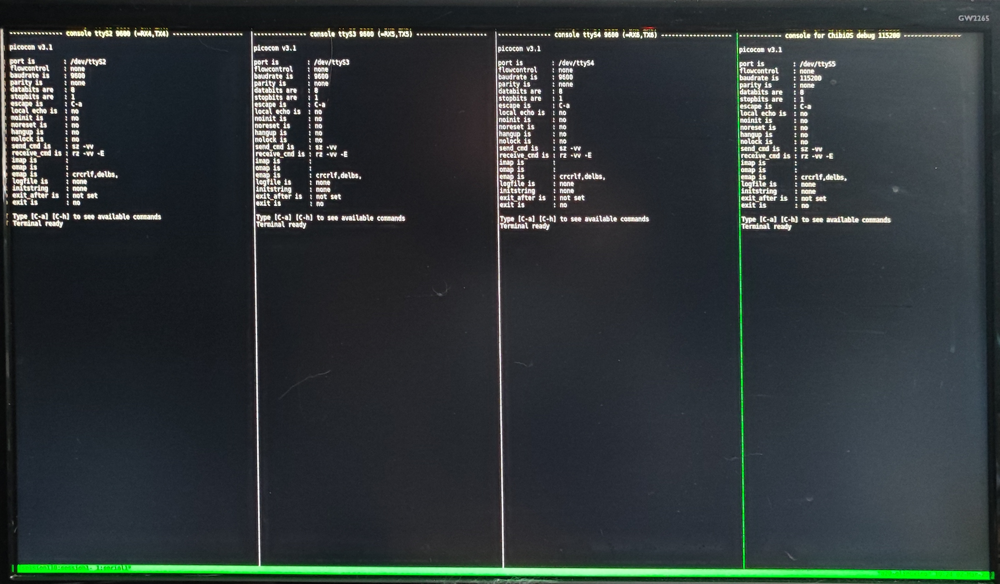

# UNICOMP #

A modular 8-bit Computer able to recreate (nearly) every microcomputer of the mid 70s to early 80s 
in Hardware without FPGAs (although an FPGA can be added). Can also be used as a teaching tool for:

* VHDL or Verilog
* C
* RTOS (STM32F401 runs ChibiOS Link: https://www.chibios.org)
* Python
* bash and linux in general (Olimex board runs linux with fbterm and tmux)
* Harwaredesign
* Timing of CPUs
* maybe Assembler
* SPI and I2C Interfaces
* CPLDs and FPGAs

It is different from other designs because of these points:

* it uses a 3.3V only Bus,
* it uses fast RAM for chipselect with two byte resolution over the whole 1MB range,
* it uses one SRAM for RAM and ROM replacement (can be write writeprotected) with 512kB (1MB possible),
* it uses a clock generator chip (DS1085) - no more crystals to change,
* it is configureable via STM32 (RAM and ROM content, Clock frequency, chip select lines),
* it can program the CPLDs (only XC9572 and XC9536 tested) from the olimex board - no external programmer and no cables to connect,
* Board size is 100mm x 100mm - no backplane (like the PC/104 standard. Link: https://en.wikipedia.org/wiki/PC/104).
* and maybe most convenient: it can change RAM and ROM content on the fly without crashing the CPU. 
  For example starting the Apple I, going into Basic and uploading the program in about half a second is really nice.

Version 2.00

Unicomp plus Logic Analyzer:

### Unicomp modules ###

* Input board:
	- a simple board to connect the signals to a linux SBC like a Raspberry Pi or an Olimex A20
	- also generates the main clock with a DS1085 chip (in v2 this will be moved to the RAMROM board).
	- no CPLD

* CPU board:
	- can be any 8-bit CPU (6502, 6802, 6809, 68008, 6803, 8051,...)
	- a CPLD (XC9572) for clock generation and glue logic

6502 Board:

* Multi Serial boaŕd:
	- suggested chip select #0
	- two chip selects on board (second one not connected, but broken out)
	- can be used with the following serial interface chips: MC6850, MOS6551, MOS6552 or pin compatible
	- SRAM for address decoding

Multi Serial Board:

* Multi Parallel boaŕd:
	- suggested chip select #1
	- two chip selects on board
	- can be used with the following parallel interface chips: MC6820, MC6821, MOS6520, MOS6521, MOS6522, MOS6526, MOS8520, MOS6532 in the first slot
    - the first slot can additionally mimic a MOS6530
	- the second slot can accommodate a MOS6522 or pin compatible
    - SRAM for address decoding

* RAMROM board:
	- chip select fixed at #14 (for chipselect RAM) and #15 (rom content)
	- 512k of SRAM plus an extra RAM for address decoding
	- a STM32F401 'blackpill' board to fill the SRAMs with data over USB port from the SBC
	- USB shell on the STM32 to change ROM content on the fly
	- also configures the Address Range of all peripheral modules

* Prototype board:
	- empty board for prototyping
	- no CPLD
    - SRAM for address decoding

* MAX-II (EPM240) board:
	- CPLD plus Buffers

* self made module:
	- chip select can be any non-used line in the Range from 0 to 13.
	- size is 100mm x 100mm
	- there is the prototype board in the repository for the position of the connectors and also the labels (pinout)

### Configuration RAM ###

The configuration is done with 128kx8 fast ram on the peripheral boards. These will be configured from the STM32F401.
One bit is for one Output (of which there are two) and for two addresses (resolution for chipselect is 2 bytes).
The cs = 15 is for writing the main RAM, cs = 14 is the chip select for the RAMROM board.
The rest is free. With two chip select lines per board these are 28 lines.
One byte in the mapping ram has the following format:

| 7    | 6    | 5    | 4    | 3    | 2    | 1    | 0    | Bits       |
|------|------|------|------|------|------|------|------|------------|
| 7,6  | 5,4  | 3,2  | 1,0  | 7,6  | 5,4  | 3,2  | 1,0  | Address    |
| /CS0 | /CS0 | /CS0 | /CS0 | /CS1 | /CS1 | /CS1 | /CS1 | Peripheral |
| /CS  | /CS  | /CS  | /CS  | WP   | WP   | WP   | WP   | RAMROM     |

So 128k are good for 128kx8 Bytes of Addressspace (=1MByte)
The data gets transferred to the STM32 in compact form. Only the Start address, the chipselect and the bitmask (which is Low-active) for every addresses where someting changes are transferred.
A 0xFE for a bitmask means Peripheral chipselect /CS1 is active for two addresses. If the board is the RAMROM board the low nibble is Writeprotect (Hi-active).

A simple configuration block looks líke this:

    (RAM: 0-9FFF, ACIA0: A000-A001, ACIA1: A010-A011, ROM: C000-FFFF)

    00 00 00 0E 00  :  RAM
    00 A0 00 00 EF  :  ACIA0
    00 A0 02 FF FF  :  HOLE
    00 A0 10 00 FE  :  ACIA1
    00 A0 12 FF FF  :  HOLE
    00 C0 00 0E 0F  :  ROM
    01 00 00 FF FF  :  END
    00 00 00        :  noting further

### Working Recreations of old computers ###

| Name                     | prim. IO    | chips used                    | os                               | weblink                                                             |
|--------------------------|-------------|-------------------------------|----------------------------------|---------------------------------------------------------------------|
| Grant Searle 6502 board  | serial      | MOS6502, MC6850               | OSI Basic                        |Link: http://searle.x10host.com/6502/Simple6502.html                 |
| Daryl Rictor 6502 board  | serial      | MOS6502, R6551                | SBC-2 (monitor only)             |Link: https://sbc.rictor.org/info2.html                              |
| Daryl Rictor 6502 board  | serial      | MOS6502, MC6850               | SBC-2 (monitor only)             |Link: https://sbc.rictor.org/info2.html                              |
| SYM1                     | serial      | MOS6502, UM6532               | SYM1 ( +BASIC +RAE)              |Link: http://retro.hansotten.nl/6502-sbc/synertek-sym-ktm/sym-1/     |
| KIM1                     | serial      | MOS6502, UM6532               | KIM1                             |Link: http://retro.hansotten.nl/6502-sbc/kim-1-manuals-and-software/ |
| Apple I                  | serial      | MOS6502, MĆ6821 (plus Arduino)| Wozmon + BASIC                   |Link: http://retro.hansotten.nl/6502-sbc/apple-1/                    |
| Motorola MEK D2          | serial      | MC6802, MĆ6850                | newbug, xswtbug, mondeb          |Link: https://www.retrotechnology.com/restore/smithbug.html          |
| Motorola MEK D1          | serial      | MC6802, MĆ6821 (plus Arduino) | Mikbug                           |Link: https://www.retrotechnology.com/restore/smithbug.html          |
| Heathkit ET3400          | serial      | MC6802, MĆ6850                | MITS BASIC, TSC MicroBASIC,...   |Link: https://github.com/jefftranter                                 |
| SWTPC 6800               | serial      | MC6802, MĆ6821 (plus Arduino) | Mikbug                           |Link: https://deramp.com/swtpc.com/                                  |
| SWTPC 6800               | serial      | MC6802, MĆ6850                | SWTBUG, SWTBUGA, Mondeb, xSWTBUG |Link: https://deramp.com/swtpc.com/                                  |
| DREAM 6800               | BAS (Video) | MC6802, MAX-II                | DREAM operating System (Chip8)   |Link: http://www.mjbauer.biz/DREAM6800.htm                           |

### linux single board computer (SBC) ###

I uses an olimex A20 SBC (olinuxino A20) which has a lot of peripherals (4x UART, 2x SPI, 2x I2C, a lot of GPIOs, SATA, 2x SDCARD, VGA, HDMI, LAN,...)
and it is open hardware. The board is connected with three 40 pin cables (like old IDE cables) plus two 10 pin cables to the input board.

To access all the peripherals i use python with the pyA20 library here: https://pypi.org/project/pyA20/   
The debian image (bullseye minimal) can be found at: http://images.olimex.com/release/a20/   
To configure the image after downloading there are helper scripts in the unicomp folder under: olimex Board/config 
I use fbterm and tmux for a nice terminal output. Here are some pictures:   
tmux main window:

tmux serial window:

### python helper scripts ###

-- all scripts have to be executed with sudo bacause of direct hardware access!

* UC_set_freq.py 
	- can set the frequency for the main clock input
	- read and write registers of the DS1085 chip
	- Example: sudo UC_set_freq.py -M 14 - sets clock to 14 MHz
	- Example: sudo UC_set_freq.py -k 14318 - sets clock to 14.318 MHz
	- Example: sudo UC_set_freq.py -f 14318180 - sets clock to 14.31818 MHz
	- Example: sudo UC_set_freq.py DIV -v 245 - sets divider to 245

* UC_configure.py [configdir]
	- configures the RAM, ROM and chipselect of all the boards with a configuration file
	- Example: sudo UC_configure.py apple1

* set_reset.py [0,1,xx]
	- sets the reset line high or low (low = active)
	- if value is anything other than 0 or 1 then a reset of approx. 10mS will be performed.

* UC_check_jtag.sh
	- looks for devices (CPLDs) in the JTAG chain.

* UC_write_cpld.sh [0..?] [.jed file]
	- writes the .jed file to the selected devices
	- Example: sudo UC_write_cpld 0 filename.jed - writes .jed file to cpld zero

* Prepare new SD-Card:
    - copy image to sd-card:
    sudo dd if=A20-OLinuXino-bullseye-minimal-20230515-130040.img of=/dev/sdb bs=1k status=progress
    - start olimex an login with olimex/olimex
    - change password with: sudo passwd olimex to something shorter like 'oli'
    - make update: sudo apt update && sudo apt upgrade
    - install minimal components: sudo apt install git mc
    - clone github repository: git clone https://github.com/roberto314/Unicomp2.git
    - open midnight commander: mc
    - navigate into Unicomp2/olimex_board/config
    - Run script: install_software.sh
    - Run script: copy_files.sh
    - restart

### CPLD programming ###

* compiling the vhdl (or verilog) code must be done on a computer with the Xilinx ISE 14.7 toolchain installed.
 Link: https://www.xilinx.com/support/download/index.html/content/xilinx/en/downloadNav/vivado-design-tools/archive-ise.html

* compiling itself can be done inside ISE or with the supplied makefile (look inside the bord directory in cpld firmware)

* a simple **make** will compile the firmware and a **make transfer** will transfer the file to the sbc (if you changed the ip address to your address inside the makefile and the path inside project.cfg)

* on the sbc in the work folder one can find the .jed file. For programming type: **UC_write_cpld [JTAG-position] [filename.jed]**

### Used Software and OS ###

* Linux Mint (20.3 cinnamon) (Link: https://linuxmint.com/)
* Sublime Text 3 (Link: https://www.sublimetext.com/)
* 010 Editor (Hex Editor) (Link: https://www.sweetscape.com/010editor/)
* Chibi Studio 20 (IDE for ChibiOS) (Link: https://www.chibios.org/dokuwiki/doku.php?id=chibios:products:chibistudio:start)
* Wavedrom (2.9.1) (Link: https://wavedrom.com/)
* Pulseview (0.5.0-nightly Appimaage) (Part of sigrok) (Link: https://sigrok.org/wiki/PulseView)
* Logisim-Evolution (3.8.0) (Link: https://github.com/logisim-evolution/logisim-evolution)
* Quartus (13.0.1 Build232 Web Edition - 64 Bit) for MAX-II
* Xilinx ISE (14.7 - 64 Bit) for XC9572

### Used Hardware ###

* Oscilloscope: Rigol DS1054Z (4 channel)
* Logic Analyzer: Hantek 4032L (32 channel)
